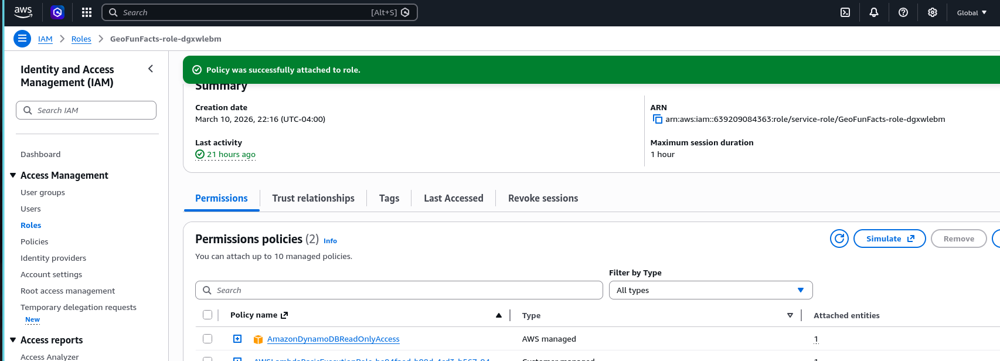

# Geography Fun Facts Generator (AWS Serverless Project) 


## Project Overview

The Geography Fun Facts Generator is a serverless application that returns
random geography facts.

Users click a button on a web page and receive a fun geography fact.
Behind the scenes, an API triggers a Lambda function that retrieves a fact
from DynamoDB and returns it to the frontend.

This project demonstrates how multiple AWS services work together
to create a simple serverless application.


## Architecture

User
→
Frontend Website
 →
API Gateway
→
Lambda Function
→
DynamoDB
→
Response returned to user

---

## AWS Services Used

- AWS Lambda
- Amazon API Gateway
- Amazon DynamoDB
- AWS IAM
- AWS Amplify (for hosting frontend)
- Amazon CloudWatch (logs)

---

## Features

- Serverless backend
- API-based architecture
- Database-driven responses
- Simple web frontend
- Cloud logging and monitoring

---

## Architecture Diagram


---

## Screenshots

### Application Interface
#### App Homepage 
#### Generated Fact 

### API Gateway Endpoint
#### Create API 
#### API Info 
#### Test API 

### Lambda Function


### DynamoDB Table


### IAM Permissions


### CloudWatch Log Group


---

## Example Lambda Function

```python
import boto3
import random
import json

# Create DynamoDB client
dynamodb = boto3.resource("dynamodb")
table = dynamodb.Table("GeoFacts")

def lambda_handler(event, context):
    # Scan entire table
    response = table.scan()
    items = response.get("Items", [])

    if not items:
        return {
            "statusCode": 500,
            "body": json.dumps({"error": "No facts found"})
        }

    # Pick random fact
    fact = random.choice(items)["FactText"]

    return {
        "statusCode": 200,
        "headers": {"Content-Type": "application/json"},
        "body": json.dumps({"fact": fact})
    }
